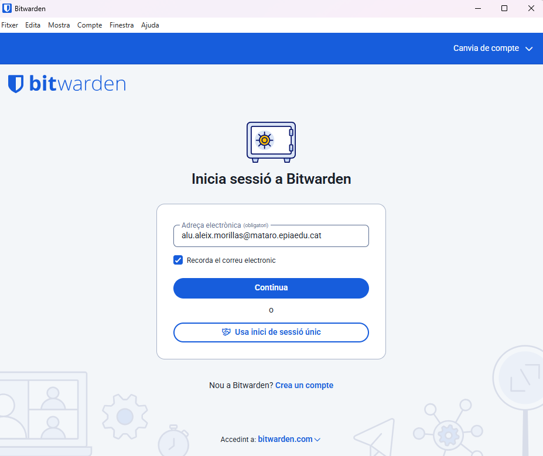

# **Guia d’Ús de Bitwarden per a l’Equip Tècnic**

---

##  **1\. Instal·lació i Configuració Inicial**

### **🔹 Pas 1\. Descàrrega de Bitwarden**

1. Anem a la pàgina oficial: [https://bitwarden.com/download/](https://bitwarden.com/download/)

2. Seleccionem la versió adequada:

   * **Windows / macOS / Linux** → Aplicació d’escriptori

---

### **🔹 Pas 2\. Creació del Compte Mestre**

1. Obrim Bitwarden després d’instal·lar-lo.

2. Fem clic a **“Create Account”**.

3. Introduïm:

   * **Email corporatiu**

   * **Contrasenya mestra segura** (mínim 12 caràcters, amb majúscules, minúscules, números i símbols)

4. Guardem la contrasenya mestra en un lloc segur (NO dins de Bitwarden).

---

### **🔹 Pas 3\. Creació de la BBDD principal (Vault)**

* Un cop iniciada la sessió, Bitwarden crea automàticament el **Vault** (la base de dades on es guarden les contrasenyes).

* Tot el contingut es xifra localment amb la contrasenya mestra abans d’enviar-se al núvol.

---

## **2\. Generació de Contrasenyes Segures**

### **🔹 Pas 1\. Obrir el Generador de Contrasenyes**

1. A la interfície principal, feu clic a **“Add Item”** o a **“Generator”** (icona de claus).

2. Seleccionem els paràmetres desitjats:

   * **Longitud:** recomanat entre 14 i 20 caràcters.

   * **Tipus de caràcters:** lletres majúscules/minúscules, números, símbols.

   * **Evitar caràcters similars** (com 0/O o l/I).

### **🔹 Pas 2\. Copiar i Utilitzar**

* Fem clic a **“Copy Password”** i enganxem-la on calgui.

* Podem guardar directament la contrasenya generada com a nova entrada al Vault.

---

## **3\. Exemples d’Ús i Emplenament Automàtic**

### **🔹 A. Desa d’una credencial de correu electrònic**

1. Cliquem **“Add Item”** → **Login**.

2. Omplim:

   * **Nom:** Compte Gmail

   * **Usuari:** nom@empresa.com

   * **Contrasenya:** (afegim la contrasenya o generem una nova)

   * **URL:** [https://mail.google.com](https://mail.google.com/)

3. Desem amb **“Save”**.

---

### **🔹 B. Desa d’una credencial d’una aplicació o servei web**

1. Repetim el mateix procés amb el nom i l’enllaç del servei (ex: GitHub, Jira, etc.).

2. Podem afegir **notes**, **carpetes** o **etiquetes** per organitzar millor les credencials.

---

### **🔹 C. Ús de l’Extensió del Navegador**

1. Instal·lem l’extensió des de la botiga del vostre navegador.

   * Exemple: [Bitwarden Chrome Extension](https://chrome.google.com/webstore/detail/bitwarden-free-password-m/nngceckbapebfimnlniiiahkandclblb)

2. Iniciem sessió amb el nostre compte.

3. Quan entrem en una pàgina d’inici de sessió, Bitwarden mostrarà automàticament les credencials guardades.

4. Feu clic a **“Autofill”** per emplenar usuari i contrasenya automàticament.

---

## **4\. Gestió de Còpies de Seguretat (Backup)**

### **🔹 Pas 1\. Exportació de la BBDD**

1. A l’aplicació d’escriptori o web:

   * Anem a **Settings → Tools → Export Vault**.

2. Seleccionem format **.json** o **.csv**.

3. ⚠️ **Atenció:** l’arxiu exportat NO està xifrat. S’ha de protegir immediatament.

---

### **🔹 Pas 2\. Bones pràctiques per a l’emmagatzematge segur**

* Desa la còpia en un **dispositiu USB xifrat** (per exemple, amb VeraCrypt).

* O bé, en un **servei d’emmagatzematge al núvol amb xifratge de punta a punta**, com p. ex. Tresorit o Proton Drive.

* **No** guardis la còpia a la mateixa màquina on es fa servir Bitwarden.

* Actualitza la còpia cada 3-6 mesos.

---

## **5\. Recomanacions Finals**

✅ Mantén Bitwarden actualitzat.  
✅ Activa l’**autenticació de dos factors (2FA)** al compte mestre.  
✅ No comparteixis mai la contrasenya mestra.  
✅ Utilitza carpetes o col·leccions per organitzar les credencials per departaments.
